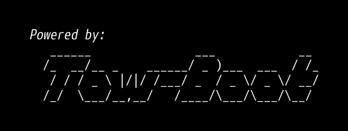

<em>An opinionated distribution of U-Boot.</em>

What is this?
-------------

The goal is to produce a user-friendly distribution of *U-Boot*, where there is
as few differences in features possible between boards, and a "familiar" user
interface for an early boot process tool.

Goals
-----

### Simple and boring

Install firmware, boot distro. No other steps.

### "Normal" BIOS-like experience

On boards with dedicated storage for the firmware, the *Tow-Boot* build should
be independent from, and not care about the installed system media.

Update should be handled out-of-band (through a firmware update option in the
firmware, or from distro-independent systems like *fwupd*). The firmware is not
"owned" by the currently running distro. The firmware is not updated or changed
through package upgrades.

Having no bootable storage, or all blanked bootable storage should still show
a "useful" boot interface. (E.g. explaining what to do and giving some basic
information about the board)

Configuration should be handled through menu-based interfaces. Options changed
in the menu interface are saved to the firmware storage.

### Boot modes

Support for generic mainline-based ARM distros as a first class citizen. Whether
they boot using UEFI (preferred), or extlinux-compatible boot.

See [`README.distro`](https://source.denx.de/u-boot/u-boot/-/blob/master/doc/README.distro)
from *U-Boot* for all the boot modes that aim to be supported.

### Pretty and boring

A logo, instructions on how to to get to the firmware interface. That's it.

Serial output should stay as verbose as mainline *U-Boot* is.

The firmware interface is menu-driven. Though breaking out into hush is
supported for more involved needs.

### Unsurprising and boring

No needless board-specific or SoC-specific differences in builds.

Boot order is unsurprising: on shared storage, the storage from which the
currently running *Tow-Boot* is running is prioritized by default.

Bootable targets are listed in the menu driven interface.

Documentation
-------------

Until a website is produced with the documentation, please read the
documentation found under the `doc/` directory.

There may be additional `.md` files elsewhere in the tree, relevant to the
files close-by.

Questions
---------

### Why this instead of my distro's *U-Boot* build?

In this project's opinion, the distribution shouldn't be managing the firmware
used to boot the system.

Confusingly enough, *U-Boot* is **both** a firmware (think "BIOS") and a
bootloader (think "grub").

The firmware should be a basic constant on the system, with well-defined
semantics allowing either a bootloader or an operating system to start.

Should all the distributions *have to* build and manage all the BIOS for all
your boring `x86_64` machines too?

### Why the *Tow-Boot* name?

Because of the pun on towboats.

* * *

License
-------

Unless stated otherwise with a SPDX header, the Nix expressions are under the
license declared in `COPYING`, the MIT License. This applies only to the
packaging infrastructure.

U-Boot derived code is licensed the same as U-Boot, which is GPL-2.0+. All
patches are owned by their authors under the same license.

At the risk of repetition **the produced binaries are GPL-2.0+**, since
*U-Boot* itself is.
